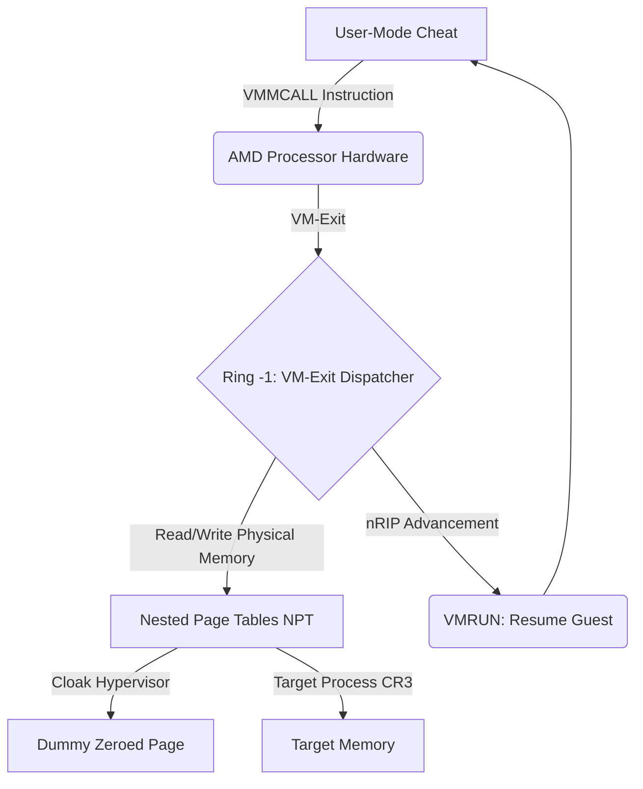

<div align="center">
  
# 🛑 AMD-SVM Hypervisor Apex
### Ring -1 Bare-Metal Anti-Cheat Bypass

[](https://github.com/)
[](https://github.com/)
[](https://github.com/)
[](https://github.com/)

</div>

<br/>

## 📖 Overview

**AMD-SVM Hypervisor Apex** is a production-grade, bare-metal Type-1 Hypervisor designed exclusively for AMD processors. It operates entirely in **Ring -1**, swallowing the Windows operating system and placing it inside a Virtual Machine. 

This architecture provides absolute invisibility against modern kernel-level anti-cheats (Vanguard, BattlEye, EAC). By completely abandoning standard Windows APIs and Ring-0 IOCTLs, this hypervisor executes memory operations via native AMD hardware intercepts, leaving zero footprint in the OS.

---

## ⚡ Core Features

### 🛡️ Hardware Memory Cloaking (Nested Page Tables)
The hypervisor maps 512GB of physical memory via AMD's **Nested Page Tables (NPT)**. To achieve true invisibility, the physical pages where the hypervisor resides are dynamically unhooked and redirected to a zeroed dummy page. When an anti-cheat scans physical memory, the AMD processor intercepts the read in hardware and feeds it raw zeros. **We do not exist.**

### ⏱️ RDTSC Timing Spoofing
Anti-cheats detect virtualization by measuring instruction execution time via `RDTSC`. A VM-Exit takes thousands of clock cycles. Instead of intercepting the instruction directly, this hypervisor features a time manipulator in the VM-Exit Dispatcher. It calculates the exact cycles spent in Ring -1 and subtracts them from the hardware `TSC_Offset`. The clock literally pauses for the Guest OS. **Zero delay detected.**

### 🔗 VMMCALL Hypercall Integration
Say goodbye to `\Device\Null` and `DeviceIoControl`. The user-mode loader communicates with the kernel by executing the native `VMMCALL` assembly instruction. This triggers an immediate, hardware-level VM-Exit, pausing the OS, completing the memory read/write via NPT, and resuming execution flawlessly.

### 💀 Zero-BSOD Dispatcher
An infinite hardware assembly loop manages the world-switch (`VMRUN`). Intercepted instructions are cleanly handled by a C-based dispatcher that dynamically advances the Guest's Instruction Pointer (`nRIP`). The system remains 100% stable under heavy hypercall load.

### 🎭 CPUID Spoofing
Intercepts `CPUID` execution and masks the 31st bit of the ECX register. Anti-cheats checking for hypervisor presence will receive a bare-metal response.

---

## 🏗️ Architecture



---

## 🛠️ Compilation & Usage

### Prerequisites
- **CPU:** AMD Processor with SVM (Secure Virtual Machine) support enabled in BIOS.
- **OS:** Windows 10 / 11 (x64).
- **IDE:** Visual Studio 2019/2022 (WDK Installed).

### Build Instructions
1. Open `ZulaDriver.vcxproj` in Visual Studio.
2. Ensure the build configuration is set to **Release | x64**.
3. **Critical:** Ensure `asm_svm.asm` is included in the project and its Item Type is set to **Microsoft Macro Assembler**.
4. Build the solution.

### Loading
Use a manual mapper (e.g., `kdmapper`) to map the compiled `.sys` file into memory.
```cmd
kdmapper.exe ZulaDriver.sys
```
*Note: Upon successful mapping, the screen may freeze for a microsecond as the processor splits reality and boots Windows into the VM.*

---

## ⚠️ Disclaimer
This project is provided for educational and research purposes only. It is a proof-of-concept for exploring hardware virtualization and operating system internals. The author is not responsible for any misuse, damage, or account bans resulting from the use of this software.
